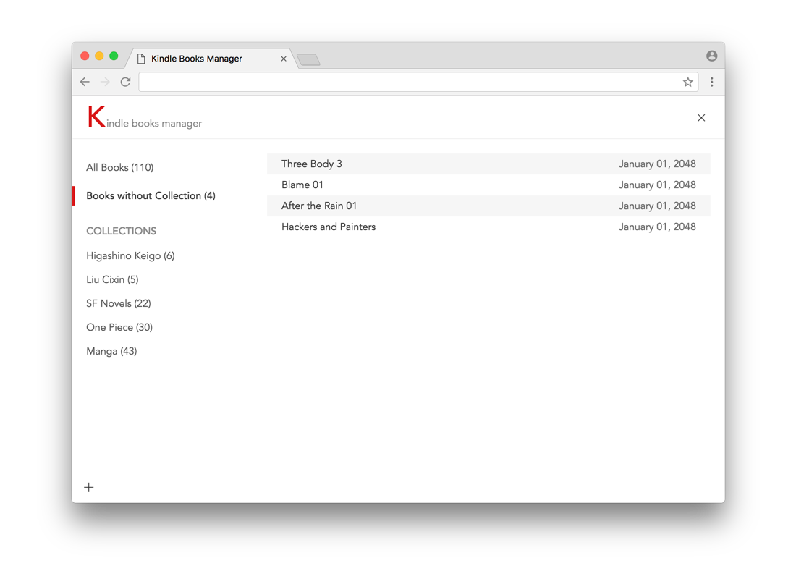

# Kindle Books Manager

A browser extension (a desktop app) to manager your kindle books easily likes any file manager.

### Usage

1. Download [extension](https://github.com/keiww/kindle-books-manager/raw/master/kindle-books-manager.crx) and install in Google Chrome browser

2. Open [https://www.amazon.cn/mn/dcw/myx.html/](https://www.amazon.cn/mn/dcw/myx.html/) and click Button `Book Manager`.

3. Then you will get a kindle books manager.

> Desktop app using [pywebview](https://github.com/r0x0r/pywebview) is WIP.
