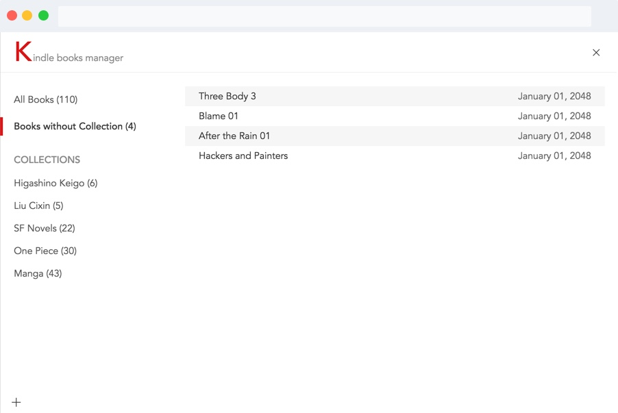

# Kindle Books Manager

A browser extension (a desktop app) to manager your kindle books easily likes any file manager.

### Usage

Install Chrome extension in 

Open [https://www.amazon.cn/mn/dcw/myx.html/](https://www.amazon.cn/mn/dcw/myx.html/) and click Button `Book Manager`.

You will be given a kindle books manager.

